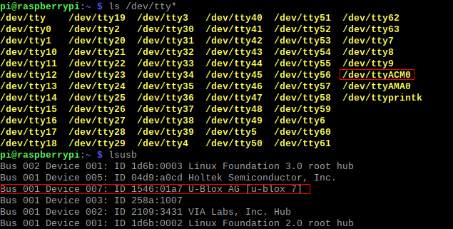
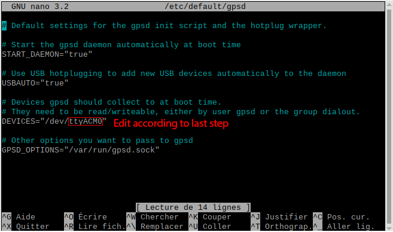
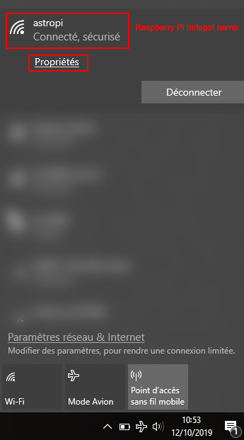
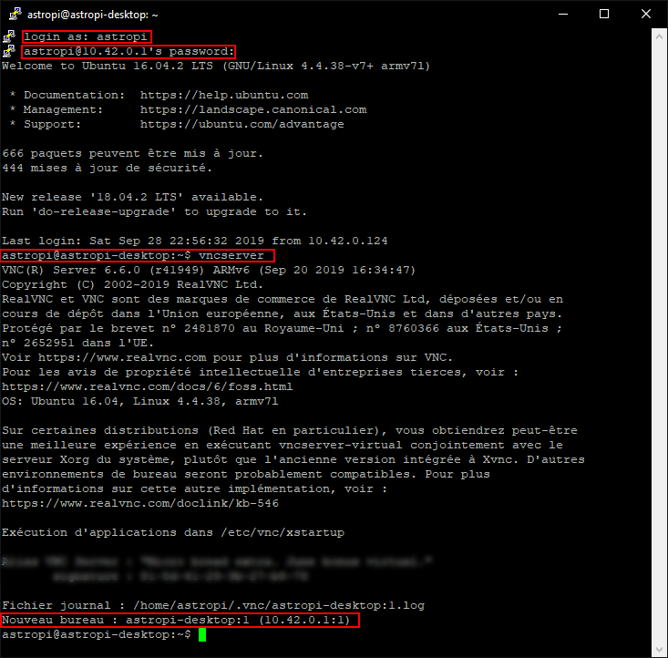

# Contrôler son télescope facilement et pour pas cher avec un Raspberry Pi 3

## 1. Introduction

Utiliser un ordinateur portable pour l'astrophotographie peut parfois être pénible et compliqué. Sur le terrain, vous devez vous soucier de la durée de vie de la batterie, des longs câbles reliant tous les accessoires (caméra, focuser, monture, roue à filtres, autoguidage...), des pilotes et de la compatibilité, etc. Cela peut rapidement devenir difficile. Une bonne alternative consiste à utiliser un Hub USB attaché à la monture, mais cela ne résout qu'un tiers des problèmes mentionnés ci-dessus. Afin de me sortir du pétrin, j'ai trouvé une solution légère, portable, fonctionnelle et bon marché pour tout équipement d'astrophotographie.

_Read this in English: https://github.com/Kelian98/Easy-astrophotography-equipment-control/blob/master/README.md_

> Remarque 1 : J'ai attaché le Raspberry Pi au télescope en utilisant du velcro, ça fonctionne plutôt bien !

> Remarque 2 : Comme vous pouvez le constater, il me reste encore de longs câbles sur cette photo. Depuis, je les ai remplacés par des câbles plus courts.

## 2. Équipement nécessaire

Tout d'abord, nous supposerons que vous avez un tube optique, une monture GoTo, une caméra et une caméra de guidage. C'est tout ce dont nous avons besoin pour configurer un mini-ordinateur capable de gérer tous ces périphériques. Il est possible d’ajouter plus d’accessoires, notamment une roue à filtre, un focuser électronique, etc.

Pour notre système, nous utiliserons :

- [Raspberry Pi 3](https://www.amazon.fr/s?k=raspberry+pi+3&__mk_fr_FR=%C3%85M%C3%85%C5%BD%C3%95%C3%91&ref=nb_sb_noss_2 "Raspberry Pi 3") avec boitier, dissipateurs thermiques et carte Micro SD (minimum 32Go)
- [Batterie externe USB](https://www.amazon.fr/s?k=batterie+externe&__mk_fr_FR=%C3%85M%C3%85%C5%BD%C3%95%C3%91&ref=nb_sb_noss_1 "Batterie externe USB") ayant une capacité d'au moins 10,000mAh et une sortie 2.1-2.5A.
- [Câble spécifique](https://www.pierro-astro.com/materiel-astronomique/accessoires-informatiques/interface-usb-heq5-direct-pour-montures-heq5-neq5-neq3-orion-sirius_detail "Câble spécifique") pour connecter la monture à la Raspberry Pi 3.
- [GPS USB](https://www.amazon.fr/s?k=vk-172&__mk_fr_FR=%C3%85M%C3%85%C5%BD%C3%95%C3%91&ref=nb_sb_noss_2 "GPS USB") pour obtenir la localisation précise du lieu où le télescope se trouve (j'utilise un Vk-172, mais le Vk-162 est doté d'une meilleure antenne et est également compatible).

Comme vous pouvez le constater, cela coûte environ 100€, bien moins cher qu’un ordinateur astro dédié fonctionnant sous Windows avec des logiciels commerciaux et nécessitant une alimentation 12V.

> Remarque : Vous pouvez économiser un peu d'argent si vous possèdez des résistances chauffantes USB pour vos tubes optiques comme [celles-ci](https://www.amazon.fr/COOWOO-Chauffe-Objectif-r%C3%A9gulateur-temp%C3%A9rature-t%C3%A9lescopique/dp/B07MHGW4DG/ref=sr_1_5?__mk_fr_FR=%C3%85M%C3%85%C5%BD%C3%95%C3%91&keywords=r%C3%A9sistance+chauffante+usb&qid=1565702995&s=gateway&sr=8-5). En effet, l’achat d’une batterie externe USB d’une capacité supérieure à 10 000 mAh (disons +20 000 mAh) vous permet d’alimenter le Raspberry Pi et vos résistances chauffantes USB pendant une nuit. Et c'est plus pratique que d'avoir de longs câbles partant de votre batterie AGM 12V jusqu'au télescope en mouvement. Voir [Consommation d'énergie mesurée du Raspberry Pi 3](https://raspi.tv/2016/how-much-power-does-raspberry-pi3b-use-how-fast-is-it-compared-to-pi2b) pour plus d'informations.

## 3. Logiciel

On va mettre [Ubuntu Mate 16.04](https://ubuntu-pi-flavour-maker.org/download/ "Ubuntu Mate 16.04") sur le Raspberry Pi 3. Il s'agit d'un OS open-source basé sur Linux. Nous installerons des logiciels d’astronomie, notamment Kstars et Ekos (bibliothèque INDI), que nous utiliserons principalement.

> Remarque : Je n'utilise pas la version la plus récente 18.04 pour l'instant, car celle-ci n'est pas aussi stable et performante que la 16.04.

### 3.1 Installation d'Ubuntu Mate 16.04

Premièrement, vous pouvez obtenir l'image d'Ubuntu Mate 16.04 sur ce lien : https://ubuntu-pi-flavour-maker.org/download/. 
Ensuite, si vous êtes sous Windows, téléchargez la dernière version de Etcher à partir de ce lien : https://www.balena.io/etcher/. 
Enfin, obtenez la version gratuite de Winrar pour décompresser le fichier image : https://www.win-rar.com/start.html?&L=0.

Maintenant que nous avons terminé l’installation des logiciels, voyons comment installer Ubuntu Mate 16.04 sur le Raspberry Pi 3.

1. Décompressez le fichier d’extension .xz téléchargé ci-dessus avec WinRar.
2. Insérez simplement votre carte Micro SD (à l'intérieur de l'adaptateur pour le format SD) dans la fente pour carte SD de votre ordinateur.
3. Lancez Etcher, sélectionnez le fichier d’extension .img précédemment décompressé, sélectionnez le lecteur de votre carte SD et cliquez sur Flash!
4. Attendez la fin du processus ... La vitesse d'écriture dépend de votre carte Micro SD (classe 10 ou supérieure est un bon choix pour une utilisation avec Raspberry Pi).
5. Une fois le process terminé, éjectez votre carte SD de votre ordinateur et insérez-la dans le Raspberry Pi 3.

> Remarque: Certains des logiciels cités ci-dessus existent également pour les distributions MacOS et Linux.

### 3.2 Installation des logiciels

#### INDI, Ekos et Kstars

Pour installer INDI, Ekos et Kstars, assurez-vous que votre Raspberry Pi est bien connecté à Internet et suivez les étapes :

1. Ouvrez un terminal de commande en appuyant sur CTRL + ALT + T ou en faisant un clic-droit sur le Bureau puis en sélectionnant "Ouvrir dans un terminal".
2. Entrez la commande suivante : `sudo apt-add-repository ppa:mutlaqja/ppa`.
3. Ensuite, entrez : `sudo apt-get update`.
4. Une fois la MAJ finie, vous pouvez installer INDI avec la commande `sudo apt-get install indi-full gsc`.
5. Enfin, pour installer Ekos et Kstars : `sudo apt-get install indi-full kstars-bleeding`.

Tous les logiciels principaux ont été téléchargés et installés !

> Source : https://www.indilib.org/download/ubuntu.html

#### Astrometry.net pour le Platesolving

Afin d’obtenir le contrôle total de votre équipement astrophotographique, vous souhaiterez peut-être effectuer ce qu'on appelle **Platesolving**. Si vous ne savez pas ce que c'est, voici une courte définition :
_Platesolving est une technique qui mesure avec précision le point de visée du télescope en prenant une image, puis en utilisant diverses techniques de correspondance de motifs, fait correspondre les étoiles de l'image à un catalogue d'étoiles donné. En sachant approximativement où le télescope est dirigé et la focale de l'image capturée, les algorithmes de platesolving peuvent calculer le centre de l’image avec une précision inférieure à la seconde d'arc._

Si vous êtes loin de chez vous ou que vous ne pouvez pas utiliser Internet pour votre séance d'imagerie, vous devrez télécharger localement le catalogue d'étoiles sur votre appareil pour que le Platesolving fonctionne en hors-connexion :

1. Ouvrez un terminal de commande en appuyant sur CTRL + ALT + T ou en faisant un clic-droit sur le Bureau puis en sélectionnant "Ouvrir dans un terminal".
2. Entrez cette commande : `sudo apt-get install astrometry.net`
3. Ensuite, récupérez les fichiers d’index à partir de cette page: https://indilib.org/about/ekos/alignment-module.html. Je vous suggère de les télécharger à partir de votre ordinateur de bureau et de transférer les packages ultérieurement sur votre Raspberry via une clé USB ou tout autre support de média externe.
4. Copier les fichiers sur le bureau de votre Raspberry Pi dans un dossier appelé "Platesolving_files".
5. Cliquez avec le bouton droit sur Bureau et sélectionnez "Ouvrir dans le terminal". Exécutez `cd Platesolving_Files` et`ls`. Les noms des fichiers d'index doivent apparaître.
6. Exécutez `sudo dpkg -i name_of_index_files.deb` pour chaque fichier d’index que vous avez. Cela prendra pas mal de temps...
7. Tous les fichiers requis pour platesolve en hors connexion sont maintenant installés!

Par défaut, Ekos envoie une image sur le serveur astrometry.net. Veillez à bien modifier les paramètres en sélectionnant "offline".

> Sources : https://www.ccdware.com/help/ccdap5/hs670.htm ; https://indilib.org/about/ekos/alignment-module.html

#### DSLR

Cette sous-section vise à installer les pilotes requis si vous souhaitez utiliser un reflex numérique non reconnu directement par Ekos. Dans mon cas, je n’ai pas pu contrôler mon Nikon D3300 sous Windows malgré toutes les tentatives effectuées avec de nombreux logiciels (Sequence Generator Pro, BackyardNikon, APT Astrophotography Tool, etc).

J'ai trouvé un pilote appelé gPhoto pour Linux disponible [ici](http://www.gphoto.org/proj/libgphoto2/support.php "ici") dans lequel vous pouvez trouver tous les appareils photo reflex numériques compatibles. J'ai également pu trouver un bon tutoriel qui m'a permis de l'installer sur le Raspberry Pi 3.
Vous avez juste à suivre ces instructions : [Install libgphoto2 and gphoto2 from source on Raspberry Pi](https://hyfrmn.wordpress.com/2015/02/03/install-libgphoto2-and-gphoto2-from-source-on-raspberry-pi/ "Install libgphoto2 and gphoto2 from source on Raspberry Pi")

#### GPS

Si vous utilisez le Vk-162 ou le Vk-172, procédez comme suit :

1. Branchez le GPS sur le port USB du Raspberry Pi.
2. Ouvrez un terminal de commande en appuyant sur CTRL + ALT + T ou faites un clic droit sur le bureau et sélectionnez "Ouvrir dans le terminal".
3. Installer le package gpsd : `sudo apt-get install gpsd`.
4. Pour voir sur quel port le GPS est connecté, tapez : `ls /dev/tty*`. Lors du branchement / débranchement du GPS, certaines adresses telles que /dev/ttyACM0 or /dev/ttyACM1 devraient apparaître et disparaître . **Notez-les**.  
   
5. Maintenant, vous devez configurer le fichier GPS par défaut. Tapez `sudo pico /etc/default/gpsd` and replacez le champ DEVICES="port obtenu à l'étape 4" tel quel.  
   
6. Appuyez sur CTRL + X pour quitter et enregistrer les modifications en appuyant sur Y lorsque vous y êtes invité.
7. Toujours dans le terminal de commande, tapez : `service gpsd restart`.
8. Enfin, pour savoir si le GPS fonctionne, regardez si le voyant vert clignote et tapez : `cgps -s`, vous devriez voir les informations actuellement reçues par le GPS.  
   
9. Le GPS doit maintenant fonctionner !

Vous pouvez également regarder cette vidéo où l'auteur procède de manière similaire: https://www.youtube.com/watch?v=tQz8Fo5u7Lc&t=820s

> Remarque 1: À l'intérieur, le GPS peut ne pas trouver le signal. Je vous recommande de faire ça dehors.

> Remarque 2: Je branche toujours le GPS sur le même port USB afin de conserver le même fichier par défaut. Sinon, je devrais probablement répéter les étapes 3 et 4 chaque fois que je le branche sur un autre port USB.

### 3.3 Mise en place Kstars et Ekos

Je ne vais pas expliquer en détail comment configurer Ekos pour une utilisation générale avec votre équipement, car il existe de nombreux bons tutoriels en ligne. Voici une liste :

- Daté mais excellent tutoriel pour utilisation et configuration générale : https://www.youtube.com/watch?v=wNpj9mNc0RE (seule l'interface a été modifiée)
- Cette liste de lecture explique chaque module et son utilisation: https://www.youtube.com/playlist?list=PLn_g58xBkqHuPUUOnqd6TzqabHQYDKfK1
- Une courte session live qui explore quelques modules et fonctionnalités: https://www.youtube.com/watch?v=3uwyRp8lKt0
- La documentation officielle propose des tutoriels: https://www.indilib.org/about/ekos.html

> Remarque : Pour des sujets spécifiques, vous pouvez rechercher sur le [forum officiel INDI](https://www.indilib.org/forum.html "forum officiel INDI"), ou demander de l'aide sur les groupes Facebook...

#### GPS

Pour utiliser le GPS Vk-162 ou Vk-172 dans Ekos, procédez comme suit (à l'issue de l'étape 2.2):

1. Assurez-vous que le GPS est correctement connecté au Raspberry Pi (voir l’étape 2.2).
2. Lancez Kstars, accédez à _Settings > Configure Kstars > INDI_ et sélectionnez _GPS Updates Kstars_ sous _Time & Location updates_. Assurez-vous que _Time_ et _Location_ sont également cochés.
3. Cliquez sur _Apply_ et _OK_.  
   

Maintenant, afin de l'ajouter à votre profil Ekos, vous devez modifier votre profil Ekos et, dans _Auxiliary_, ajoutez **GPSD**.

Lorsque vous démarrez INDI, vous devriez voir quelque chose comme ceci dans la section **GPSD**:

> Note : Si vous cliquez sur **GPS** dans la section _Refresh_, les coordonnées seront mises à jour.

### 3.4 Configurer le Raspberry Pi pour une utilisation "bureau à distance"

#### VNC

Sur le terrain, vous ne pourrez peut-être pas disposer d'un moniteur de bureau, d'un clavier, d'une souris, etc. Mais vous pouvez utiliser votre ordinateur portable ou votre smartphone pour contrôler le Raspberry Pi avec **Connexion réseau virtuelle**. Bien pratique en hiver, de rester dans la voiture à l'abri du froid et de pouvoir contrôler son matos durant la session d'acquisition en mode, le tout sans-fil ! Nous utiliserons RealVNC, qui est gratuit et facile à configurer. Vous pouvez obtenir l'application RealVNC Viewer pour n'importe quelle plateforme ici: https://www.realvnc.com/fr/connect/download/viewer/

Voyons comment installer RealVNC Server sur le Raspberry Pi:

1. Accédez à cette page et téléchargez le fichier: https://www.realvnc.com/en/connect/download/vnc/raspberrypi/.
2. Déplacez-le sur le bureau de votre Raspberry Pi, ouvrez un terminal et exécutez `sudo dpkg -i name_of_package.deb`.
3. Une fois terminé, si vous exécutez `vncserver`, une connexion VNC sera établie à partir du Raspberry et vous donnera l’adresse IP.
4. Avec votre autre appareil (smartphone, ordinateur portable ...), accédez à l'application VNC Viewer, puis ajoutez la connexion Raspberry Pi avec l'adresse IP ci-dessus et le mot de passe de session.
5. Vous devriez pouvoir contrôler le Raspberry à partir de votre autre appareil sans aucun fil !
      
   

> Remarque : pour vous connecter au VNC, assurez-vous que les deux appareils sont connectés au même réseau.

#### Hotspot

Si vous ne disposez pas d'une connexion Internet, le Raspberry peut créer son propre point d'accès WiFi.
Vous pouvez procéder de la sorte pour créer le Hotspot : http://ubuntuhandbook.org/index.php/2016/04/create-wifi-hotspot-ubuntu-16-04-android-supported/.
Vous pouvez également définir la connexion en **mode automatique**. Désormais, lorsque le Raspberry démarrera, il créera automatiquement un réseau sans fil personnel.
En connectant votre smartphone ou votre ordinateur portable à ce point d'accès WiFi, vous pouvez utiliser le VNC et contrôler facilement le Raspberry.

Vous remarquerez que même si vous êtes connecté au Hotspot, vous ne pouvez pas utiliser VNC car le service doit être démarré à partir du Raspberry Pi lui-même.
Ce que je recommande, c’est d’abord de vous connecter à votre Raspberry en **SSH**, puis de démarrer le service VNC.

1. Installez [PuTTY](https://putty.org/ "PuTTY") si votre deuxième appareil est un ordinateur portable Windows ou [JuiceSSH](https://play.google.com/store/apps/details?id=com.sonelli.juicessh&hl=en "JuiceSSH") s'il s'agit d'un Android.
2. Connectez-vous au hotspot Raspberry Pi et obtenez son adresse IP. 
    
3. Entrez l'adresse IP dans PuTTY.   
   
4. Une fois connecté, entrez votre identifiant et votre mot de passe. Ensuite, lancez `vncserver`.   
   
5. Vous pouvez maintenant ouvrir VNC Viewer et contrôler votre Raspberry Pi!

## 4. Workflow habituel

1. Connectez tous vos équipements au Raspberry Pi (DSLR, caméra de guidage, GPS, support ...).
2. Démarrez le Raspberry Pi. Il créera automatiquement son propre Hotspot.
3. Connectez votre PC ou votre smartphone au Hotspot.
4. Lancez le client SSH sur votre appareil et connectez-vous au Raspberry Pi.
5. Démarrez le serveur VNC à partir de SSH.
6. Connectez votre appareil au VNC.
7. Lancez Kstars et démarrez votre session d'imagerie !   

