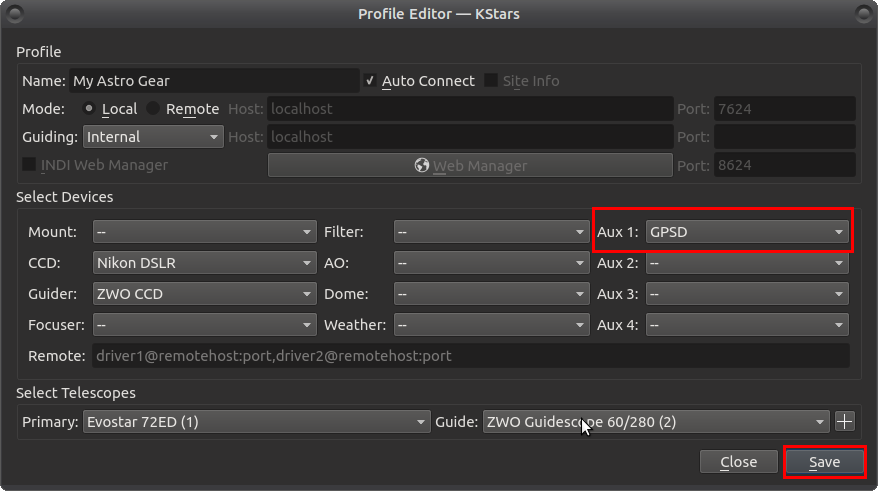
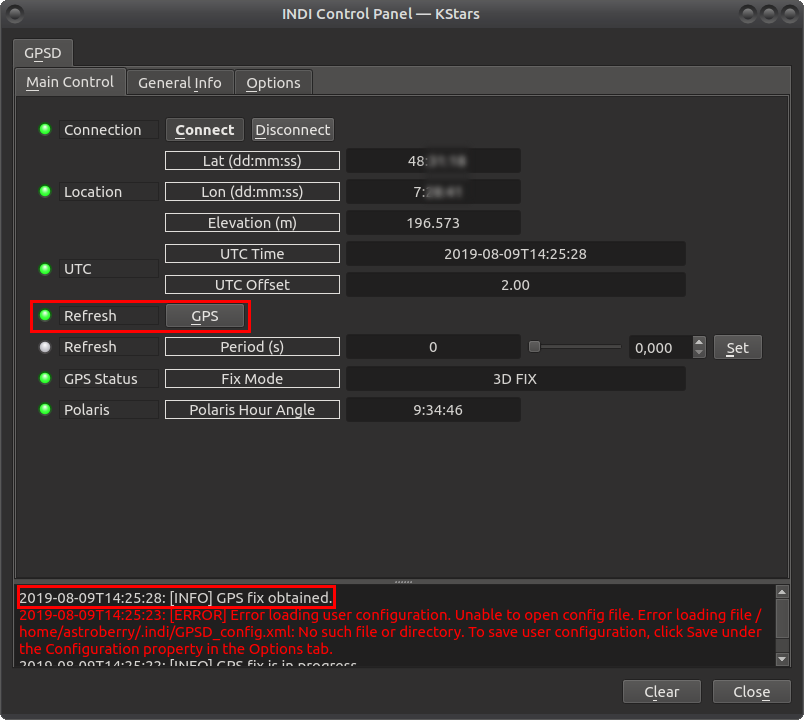
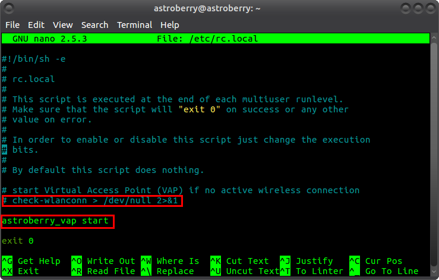

# Contrôler son télescope facilement et pour pas cher avec un Raspberry Pi 3

## 1. Introduction

Utiliser un ordinateur portable pour l'astrophotographie peut parfois être pénible et compliqué. Sur le terrain, vous devez vous soucier de la durée de vie de la batterie, des longs câbles reliant tous les accessoires (caméra, focuser, monture, roue à filtres, autoguidage...), des pilotes et de la compatibilité, etc. Cela peut rapidement devenir difficile. Une bonne alternative consiste à utiliser un Hub USB attaché à la monture, mais cela ne résout qu'un tiers des problèmes mentionnés ci-dessus. Afin de me sortir du pétrin, j'ai trouvé une solution légère, portable, fonctionnelle et bon marché pour tout équipement d'astrophotographie.

_Read this in English: https://github.com/Kelian98/Easy-astrophotography-equipment-control/blob/master/README.md_

> Remarque 1 : J'ai attaché le Raspberry Pi au télescope en utilisant du velcro, ça fonctionne plutôt bien !

> Remarque 2 : Comme vous pouvez le constater, il me reste encore de longs câbles sur cette photo. Depuis, je les ai remplacés par des câbles plus courts.

## 2. Équipement nécessaire

Tout d'abord, nous supposerons que vous avez un tube optique, une monture GoTo, une caméra et une caméra de guidage. C'est tout ce dont nous avons besoin pour configurer un mini-ordinateur capable de gérer tous ces périphériques. Il est possible d’ajouter plus d’accessoires, notamment une roue à filtre, un focuser électronique, etc.

Pour notre système, nous utiliserons :

- [Raspberry Pi 3](https://www.amazon.fr/s?k=raspberry+pi+3&__mk_fr_FR=%C3%85M%C3%85%C5%BD%C3%95%C3%91&ref=nb_sb_noss_2 "Raspberry Pi 3") avec boitier, dissipateurs thermiques et carte Micro SD (minimum 32Go)
- [Batterie externe USB](https://www.amazon.fr/s?k=batterie+externe&__mk_fr_FR=%C3%85M%C3%85%C5%BD%C3%95%C3%91&ref=nb_sb_noss_1 "Batterie externe USB") ayant une capacité d'au moins 10,000mAh et une sortie 2.1-2.5A.
- [Câble spécifique](https://www.pierro-astro.com/materiel-astronomique/accessoires-informatiques/interface-usb-heq5-direct-pour-montures-heq5-neq5-neq3-orion-sirius_detail "Câble spécifique") pour connecter la monture à la Raspberry Pi 3.
- [GPS USB](https://www.amazon.fr/s?k=vk-172&__mk_fr_FR=%C3%85M%C3%85%C5%BD%C3%95%C3%91&ref=nb_sb_noss_2 "GPS USB") pour obtenir la localisation précise du lieu où le télescope se trouve (j'utilise un Vk-172, mais le Vk-162 est doté d'une meilleure antenne et est également compatible).

Comme vous pouvez le constater, cela coûte environ 100€, bien moins cher qu’un ordinateur astro dédié fonctionnant sous Windows avec des logiciels commerciaux et nécessitant une alimentation 12V.

> Remarque : Vous pouvez économiser un peu d'argent si vous possèdez des résistances chauffantes USB pour vos tubes optiques comme [celles-ci](https://www.amazon.fr/COOWOO-Chauffe-Objectif-r%C3%A9gulateur-temp%C3%A9rature-t%C3%A9lescopique/dp/B07MHGW4DG/ref=sr_1_5?__mk_fr_FR=%C3%85M%C3%85%C5%BD%C3%95%C3%91&keywords=r%C3%A9sistance+chauffante+usb&qid=1565702995&s=gateway&sr=8-5). En effet, l’achat d’une batterie externe USB d’une capacité supérieure à 10 000 mAh (disons +20 000 mAh) vous permet d’alimenter le Raspberry Pi et vos résistances chauffantes USB pendant une nuit. Et c'est plus pratique que d'avoir de longs câbles partant de votre batterie AGM 12V jusqu'au télescope en mouvement. Voir [Consommation d'énergie mesurée du Raspberry Pi 3](https://raspi.tv/2016/how-much-power-does-raspberry-pi3b-use-how-fast-is-it-compared-to-pi2b) pour plus d'informations.

## 3. Logiciel

On va mettre [Astroberry Server](https://github.com/rkaczorek/astroberry-server "Astroberry Server") sur le Raspberry Pi 3. Il s'agit d'une version modifiée open-source de Ubuntu Mate 16.04 développée par [Radek Kaczorek](https://github.com/rkaczorek "Radek Kaczorek") qui contient tout ce dont on aura besoin.
Vous pouvez obtenir des instructions supplémentaires [ici](https://github.com/rkaczorek/astroberry-server#how-to-use-it "ici").
Le système comprend de nombreux logiciels d’astronomie, notamment Kstars et Ekos (bibliothèque INDI), que nous utiliserons.

### 3.1 Installation d'Astroberry

Premièrement, vous pouvez obtenir l'image d'Astroberry sur ce lien : https://drive.google.com/file/d/1zGwXLWDD8hubpuarafMWPft6F6Q4bV8R/view. 
Ensuite, si vous êtes sous Windows, téléchargez la dernière version de Etcher à partir de ce lien : https://www.balena.io/etcher/. 
Enfin, obtenez la version gratuite de Winrar pour décompresser le fichier image Astroberry : https://www.win-rar.com/start.html?&L=0.

Maintenant que nous avons terminé l’installation des logiciels, voyons comment installer Astroberry sur le Raspberry Pi 3.

1. Décompressez le fichier d’extension .xz téléchargé ci-dessus avec WinRar.
2. Insérez simplement votre carte Micro SD (à l'intérieur de l'adaptateur pour le format SD) dans la fente pour carte SD de votre ordinateur.
3. Lancez Etcher, sélectionnez le fichier d’extension .img précédemment décompressé, sélectionnez le lecteur de votre carte SD et cliquez sur Flash!
4. Attendez la fin du processus ... La vitesse d'écriture dépend de votre carte Micro SD (classe 10 ou supérieure est un bon choix pour une utilisation avec Raspberry Pi).
5. Une fois le process terminé, éjectez votre carte SD de votre ordinateur et insérez-la dans le Raspberry Pi 3.

> Remarque: Certains des logiciels cités ci-dessus existent également pour les distributions MacOS et Linux.

### 3.2 Drivers supplémentaires

Démarrez le Raspberry Pi 3 avec la carte SD et branchez une souris, un clavier et un moniteur.
Si tout a été fait correctement, il va démarrer et vous amener sur le bureau Astroberry.
Vous pouvez le connecter à votre réseau WiFi en cliquant sur le logo WLAN en haut à droite de l'écran. Entrez vos informations de réseau et vous serez connecté à Internet.

#### DSLR

Cette sous-section vise à installer les pilotes requis si vous souhaitez utiliser un reflex numérique non reconnu directement par Ekos. Dans mon cas, je n’ai pas pu contrôler mon Nikon D3300 sous Windows malgré toutes les tentatives effectuées avec de nombreux logiciels (Sequence Generator Pro, BackyardNikon, APT Astrophotography Tool, etc).

J'ai trouvé un pilote appelé gPhoto pour Linux disponible [ici](http://www.gphoto.org/proj/libgphoto2/support.php "ici") dans lequel vous pouvez trouver tous les appareils photo reflex numériques compatibles. J'ai pu trouver un bon tutoriel qui m'a permis de l'installer sur le Raspberry Pi 3.
Vous avez juste à suivre ces instructions : [Install libgphoto2 and gphoto2 from source on Raspberry Pi](https://hyfrmn.wordpress.com/2015/02/03/install-libgphoto2-and-gphoto2-from-source-on-raspberry-pi/ "Install libgphoto2 and gphoto2 from source on Raspberry Pi")

#### GPS

Si vous utilisez le Vk-162 ou le Vk-172, procédez comme suit :

1. Branchez le GPS sur le port USB du Raspberry Pi.
2. Ouvrez un terminal de commande en appuyant sur CTRL + ALT + T ou faites un clic droit sur le bureau et sélectionnez "Ouvrir dans le terminal".
3. Installer le package gpsd : `sudo apt-get install gpsd`.
4. Pour voir sur quel port le GPS est connecté, tapez : `ls /dev/tty*`. Lors du branchement / débranchement du GPS, certaines adresses telles que /dev/ttyACM0 or /dev/ttyACM1 devraient apparaître et disparaître . **Notez-les**. 
   
5. Maintenant, vous devez configurer le fichier GPS par défaut. Tapez `sudo pico /etc/default/gpsd` and replacez le champ DEVICES="port obtenu à l'étape 4" tel quel. 
   
6. Appuyez sur CTRL + X pour quitter et enregistrer les modifications en appuyant sur Y lorsque vous y êtes invité.
7. Toujours dans le terminal de commande, tapez : `service gpsd restart`.
8. Enfin, pour savoir si le GPS fonctionne, regardez si le voyant vert clignote et tapez : `cgps -s`, vous devriez voir les informations actuellement reçues par le GPS.
   
9. Le GPS doit maintenant fonctionner !

Vous pouvez également regarder cette vidéo où l'auteur procède de manière similaire: https://www.youtube.com/watch?v=tQz8Fo5u7Lc&t=820s

> Remarque 1: À l'intérieur, le GPS peut ne pas trouver le signal. Je recommande de faire ça dehors.

> Remarque 2: Je branche toujours le GPS sur le même port USB afin de conserver le même fichier par défaut. Sinon, je devrais probablement répéter les étapes 3 et 4 chaque fois que je le branche sur un autre port USB.

### 3.3 Mise en place Kstars et Ekos

Je ne vais pas expliquer en détail comment configurer Ekos pour une utilisation générale avec votre équipement, car il existe de nombreux bons tutoriels en ligne. Voici une liste:

- Daté mais excellent tutoriel pour utilisation et configuration générales : https://www.youtube.com/watch?v=wNpj9mNc0RE (seule l'interface a été modifiée)
- Cette liste de lecture explique chaque module et son utilisation: https://www.youtube.com/playlist?list=PLn_g58xBkqHuPUUOnqd6TzqabHQYDKfK1
- Une courte session live qui explore quelques modules et fonctionnalités: https://www.youtube.com/watch?v=3uwyRp8lKt0
- La documentation officielle propose des tutoriels: https://www.indilib.org/about/ekos.html

> Remarque : Pour des sujets spécifiques, vous pouvez rechercher sur le [forum officiel INDI](https://www.indilib.org/forum.html "forum officiel INDI"), ou demander de l'aide sur les groupes Facebook...

#### GPS

Pour utiliser le GPS Vk-162 ou Vk-172 dans Ekos, procédez comme suit (à l'issue de l'étape 2.2):

1. Assurez-vous que le GPS est correctement connecté au Raspberry Pi (voir l’étape 2.2).
2. Lancez Kstars, accédez à _Settings > Configure Kstars > INDI_ et sélectionnez _GPS Updates Kstars_ sous _Time & Location updates_. Assurez-vous que _Time_ et _Location_ sont également cochés.
3. Cliquez sur _Apply_ et _OK_.  
   

Maintenant, afin de l'ajouter à votre profil Ekos, vous devez modifier votre profil Ekos et, dans _Auxiliary_, ajoutez **GPSD**.

Lorsque vous démarrez INDI, vous devriez voir quelque chose comme ceci dans la section **GPSD**:

> Note : Si vous cliquez sur **GPS** dans la section _Refresh_, les coordonnées seront mises à jour.

### 3.4 Configurer le Raspberry Pi pour une utilisation "bureau à distance"

Un outil de "point d'accès virtuel" est déjà installé sur Astroberry. Cependant, j'ai eu quelques problèmes avec cela.
Lorsque vous avez connecté le Raspberry Pi à votre réseau sans fil personnel, la carte le recherche automatiquement au démarrage. Astroberry est généralement préconfiguré pour basculer vers son propre point d'accès virtuel s'il ne peut pas atteindre le réseau sans fil personnel. J'ai eu une grosse surprise sur le terrain quand cela n'a pas fonctionné ... Donc, pour être sûr qu'il soit toujours en point d'accès virtuel et éviter les mauvaises surprises, je vous recommande de suivre ces instructions:

1. Ouvrez un terminal avec CTRL + ALT + T
2. Tapez : `sudo nano /etc/rc.local` et entrez le mot de passe root (par défaut: astroberry)
3. Mettez la ligne `check-wlanconn > /dev/null 2>&1` en commentaire et tapez au-dessous `astroberry_vap start` comme ceci :
   
4. Exit and sauvegardez les changements apportés au fichier !

Désormais, lorsque le Raspberry Pi démarrera, il créera son propre réseau sans fil personnel appelé **astroberry**. Le mot de passe pour s'y connecter est également astroberry. Allez dans votre navigateur à http://192.168.10.1/ et vous pourrez utiliser votre Raspberry Pi en accès à distance !
