# Astrophotography equipment control

[](http://hits.dwyl.io/Kelian98/Easy-astrophotography-equipment-control)
[](https://shields.io/)
[](https://GitHub.com/Naereen/StrapDown.js/graphs/commit-activity)

## 1. Introduction

Carrying a laptop for astrophotography can sometimes be annoying. In the field, you have to worry about battery life, long cables connecting all your stuff (camera, focuser, mount, filterwheel, autoguider...), drivers and compatibility, etc. It can quickly get messy. A good alternative is to use a USB Powered Hub attached to the scope or the mount, but that only solves a third of the problems mentioned above. In order to get out of trouble, I found a solution that is light, portable, functional and cheap for any astrophotography setup.

_Lire ce document en français : https://github.com/Kelian98/Easy-astrophotography-equipment-control/blob/master/README.fr.md_


> Note 1 : I have attached my Raspberry Pi with velcro strips, it works great.

> Note 2 : As you can see, cable management is very important to keep everything steady on the scope, which I haven't done yet.

## 2. Equipment needed

First of all, we will assume that you have some scope, GoTo mount, camera, guiding camera. That's all we need for setting up a portable computer capable of managing all these devices. More accessories can be add including filter wheel, electronic focuser, etc.

For our system, we will use :

- [Raspberry Pi 4 4GB RAM](https://thepihut.com/collections/raspberry-pi-kits-and-bundles/products/raspberry-pi-starter-kit?variant=20336446079038 "Raspberry Pi 4") with case, power supply and Micro SD Card (16Go or more recommended)
- [USB Power Bank](https://www.amazon.com/s?k=power+bank&ref=nb_sb_noss_2 "USB Power Bank") with a capacity of at least 15,000mAh and 2.1-2.5A USB output
- [Specific cable](https://www.firstlightoptics.com/sky-watcher-mount-accessories/lynx-astro-ftdi-eqdir-usb-adapter-for-sky-watcher-eq5-pro-heq5-syntrek-pro-az-eq5-gt-az-eq6-gt-and-eq8-mounts.html "Specific cable") to connect your mount to the board (in this case, EQDIR cable for SkyWatcher mounts)
- [GPS USB Dongle](https://www.amazon.com/s?k=vk-172&ref=nb_sb_noss_1 "GPS USB Dongle") to obtain precise location (I use a Vk-172, but Vk-162 is built with a better antenna and is also compatible)

As you can see, it costs around 120\$, far cheaper than a dedicated astro computer running on Windows with commercial softwares which run on 12V power supply.

> Note : You can save some money if you have a USB powered dew-heater for your scope such as [these](https://www.amazon.com/Telescopes-Temperature-Control-Devices-Freezing/dp/B07R299MQT/ref=sr_1_4?keywords=dew%2Bheater%2Busb&qid=1564516783&s=gateway&sr=8-4&th=1). Indeed, buying a USB powerbank with more capacity than 10,000mAh (let's say +20,000mAh) let you power the Raspberry Pi and your dew-heater(s) for a night long. And it's more convenient than having long cables from the floor with your 12V AGM Battery ascending to the moving telescope. See [Raspberry Pi 4 measured power consumption](https://www.pidramble.com/wiki/benchmarks/power-consumption) for further information.

## 3. Software

We will run the latest version of [Raspberry Pi OS](https://www.raspberrypi.org/downloads/raspberry-pi-os/ "Raspberry Pi OS") on the Raspberry Pi 4. This is an open-source OS based on Linux made for the Raspberry Pi microcomputer. We will install astronomy softwares including Kstars and Ekos (INDI Library) we will be mainly using.

> Note : I recommend installing the version with Desktop only, since we will not be using much of the recommended software.

### 3.1 Install Raspberry Pi OS

First, get the image from this link : https://www.raspberrypi.org/downloads/raspberry-pi-os/</br>
Then, if you are on Windows, download the latest version of Etcher from this link : https://www.balena.io/etcher/.</br>
Finally, get the free version of Winrar to unpack the image file : https://www.win-rar.com/start.html?&L=0.

Now that we have finished with softwares installations, let's flash Raspberry Pi OS on the Raspberry Pi 4.

1. Unpack .xz extension file downloaded above with WinRar.
2. Simply insert your Micro SD Card (inside the adaptor for SD format) in your SD Card slot of your computer.
3. Start Etcher, select the previously unpacked .img extension file, select the drive of your SD Card, and click on Flash !
4. Wait until process is finished... Writing speed depends on your Micro SD Card (class 10 or better is a good choice for Raspberry Pi usage).
5. When it's done, eject your SD Card from your computer and insert it into the Raspberry Pi 4.
6. Start the Raspberry Pi 4 with SD Card and plug in a mouse, a keyboard and a monitor. If everything has been done correctly, it will boot up and get you to Raspberry Pi OS installation. Complete the steps required.

> Note : Some of the softwares cited above exist for MacOS and Linux distributions as well.

### 3.2 Install softwares

#### INDI, Ekos and Kstars

To install INDI, Ekos and Kstars, make sure your Raspberry Pi is connected to the Internet and follow this steps :

1. Open a command terminal by pressing CTRL + ALT + T or right-click on Desktop and select "Open in terminal".
2. Run the following commands :
```
wget -O - https://www.astroberry.io/repo/key | sudo apt-key add -
sudo su -c "echo 'deb https://www.astroberry.io/repo/ buster main' > /etc/apt/sources.list.d/astroberry.list"
sudo apt update
```
3. After the update is finished, you can install INDI with `sudo apt-get install indi-full gsc`.
4. Finally, to install Ekos and Kstars : `sudo apt-get install indi-full kstars-bleeding`.

All the main softwares have been downloaded and installed !

> Source : https://indilib.org/get-indi/download-rpi.html

#### Astrometry.net for Platesolving

In order to get full control of your astrophotography rig, you may want to do platesolving. If you don't know what it is, here is a short definition : _Platesolving is a technique that measures precisely where the telescope is pointing by taking a CCD image and then using various pattern matching techniques, matches the stars in the image to a given star catalog. Knowing approximately where the telescope is pointing and the system image scale, plate solving algorithms can calculate the center of the image to sub-arc-second accuracy. Successful plate solving is essential for automated imaging._

If you are far away from home or you can't have internet while imaging, you will have to download the star catalog locally on your device to do "offline" platesolving :

1. Open a command terminal by pressing CTRL + ALT + T or right-click on Desktop and select "Open in terminal".
2. Run this command to check if astrometry.net has been successfully installed with previous commands : `sudo apt-get install astrometry.net`
3. Then, get the index files from this page : http://data.astrometry.net/4100/. I suggest to download them from your desktop computer and transfer the packages later to your Raspberry Pi. Otherwise, you can download them by launching a terminal and entering : `wget http://data.astrometry.net/4100/index-4107.fits`
4. Copy the files to the Raspberry Pi Desktop in a folder called "Platesolving_Files".
5. Copy the content of this folder to the specific folder where astrometry.net will look for the platesolving files : `sudo cp /home/pi/Desktop/Platesolving_files /usr/share/astrometry/`
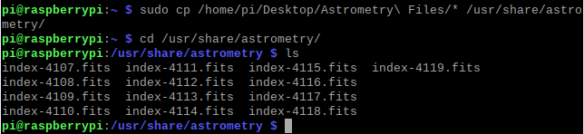
6. All required files for offline platesolving are now installed !

By default, Ekos sends an image to the astrometry.net server. Make sure to change the settings by selecting "offline".

> Sources : https://www.ccdware.com/help/ccdap5/hs670.htm ; https://indilib.org/about/ekos/alignment-module.html

#### DSLR

This sub-section aims to install required drivers if you want to use a DSLR not directly recognized by Ekos. In my case, I wasn't able to control my Nikon D3300 on Windows despite all attempts with many softwares (Sequence Generator Pro, BackyardNikon, APT Astrophotography Tool, etc). That's why I switched to Linux for astrophotography.

I found a driver called gPhoto for Linux ([here](http://www.gphoto.org/proj/libgphoto2/support.php "here") you can find all compatible DSLR Cameras) that was compatible with my camera. Normally, it is already installed on your Raspberry Pi if you have carefully followed the processus to get INDI, Ekos and Kstars. Otherwise, I was able to find a good tutorial to install it on the Raspberry Pi 4.
Normally, it should already be installed when installing INDI, Ekos and Kstars.
Just need to follow the instructions : [Install libgphoto2 and gphoto2 from source on Raspberry Pi](https://hyfrmn.wordpress.com/2015/02/03/install-libgphoto2-and-gphoto2-from-source-on-raspberry-pi/ "Install libgphoto2 and gphoto2 from source on Raspberry Pi")

#### GPS

If you use the Vk-162 or Vk-172, you can follow this steps :

1. Plug the GPS in Raspberry Pi USB port.
2. Open a command terminal by pressing CTRL + ALT + T or right-click on Desktop and select "Open in terminal".
3. Install gpsd package : `sudo apt-get install gpsd`.
4. To see on which port the GPS is connected, type : `ls /dev/tty*`. When plugging/unplugging the GPS, some address such as /dev/ttyACM0 or /dev/ttyACM1 should appear and disappear. **Keep it in mind**.<br/></br>
   
5. Now you have to configure the GPS default file. Type `sudo nano /etc/default/gpsd` and edit DEVICES="port obtained at step 4".<br/></br>
   
6. Press CTRL + X to exit and save changes by pressing Y when asked.
7. Again in terminal, type : `service gpsd restart`.
8. Finally to know if the GPS is working, look if the green LED is blinking and type : `cgps -s`, you should see current information received by the GPS.</br></br>
   
9. The GPS is now working !

You can also watch this video with similar process : https://www.youtube.com/watch?v=tQz8Fo5u7Lc&t=820s

> Note 1 : Indoor, the GPS may be unable to find signal. I recommend to do this outside.

> Note 2 : I always plug the GPS in the same USB port in order to keep the default file the same. Otherwise, I would probably have to repeat steps 3 and 4 each time I plug it in another USB port.

### 3.3 Setting up Kstars and Ekos

I will not explain in depth how to setup Ekos for general usage with your equipment because there are plenty of good tutorials online, here is a list :

- Old but great tutorial for general usage and configuration : https://www.youtube.com/watch?v=wNpj9mNc0RE (only interface has changed)
- This playlist explains each module and their usage : https://www.youtube.com/playlist?list=PLn_g58xBkqHuPUUOnqd6TzqabHQYDKfK1
- A short live session which explores some modules and functionnalities : https://www.youtube.com/watch?v=3uwyRp8lKt0
- Official documentation offers some tutorials : https://www.indilib.org/about/ekos.html

> Note : For specific topics, you can search on the [INDI official forum](https://www.indilib.org/forum.html "INDI official forum"), ask on Facebook groups...

#### GPS

To use the Vk-162 or Vk-172 GPS in Ekos, follow this steps (after completing step 2.2) :

1. Make sure the GPS is properly connected to the Raspberry Pi (see step 2.2).
2. Launch Kstars, go to _Settings > Configure Kstars > INDI_ and select _GPS Updates Kstars_ under _Time & Location updates_. Be sure that _Time_ and _Location_ are also checked.
3. Click _Apply_ and _OK_.</br></br>
   

Now, in order to add it to your Ekos Profile, you have to edit your Ekos profile and in _Auxiliary_, add **GPSD**.</br>


When starting INDI, you should see something like this under **GPSD** section :</br>


> Note : If you click on **GPS** in _Refresh_ section, coordinates will be updated.

### 3.4 Configure the Raspberry Pi for remote desktop

#### VNC

In the field, you may be unable to have a desktop monitor, keyboard, mouse, etc. But you can use your laptop or smartphone to control the Raspberry Pi with **Virtual Network Connection**. We will use RealVNC which is free and easy to configure. You can get the RealVNC Viewer app for any platform here : https://www.realvnc.com/fr/connect/download/viewer/

RealVNC Server is installed by default on the Raspberry Pi.
If it is not the cas, procede as follow :

1. Go to this page and download the file : https://www.realvnc.com/en/connect/download/vnc/raspberrypi/.
2. Move it to your Raspberry Pi desktop, open a terminal and run `sudo dpkg -i name_of_package.deb`.
3. Once completed, if you run `vncserver`, it will start a VNC connection from the Raspberry and give you the IP Address.
4. With your other device (smartphone, laptop...), go to VNC Viewer app, and add the Raspberry Pi connection with IP Address from above and session password.
5. You should be able to control the Raspberry from your other device !
   </br></br>
   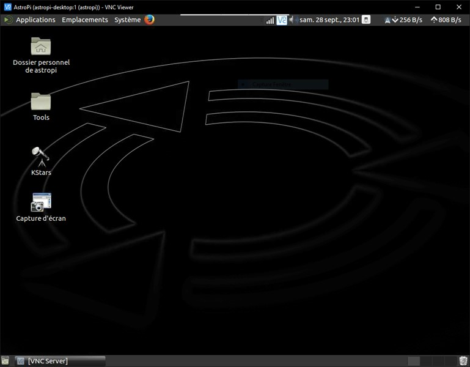

> Note : To connect to VNC, make sure that both devices are connected to the same network.

#### Hotspot

If you don't have an internet connection, the Raspberry can create his own WiFi Hotspot.
You can proceed such as follow.
You can also set the connection in **automatic mode**. Now, when the Raspberry boots up, it will create a personal wireless network automatically.
By connecting your smartphone or laptop to this WiFi Hotspot, you can do VNC and control the Raspberry Pi easily.

1. Connect to a WIFI / Ethernet network with an internet connection
2. Update the Raspberry Pi with `sudo apt update`
3. Install network-manager: `sudo apt install network-manager-gnome`
4. Disable the dhcpcd services:
   `sudo systemctl stop dhcpcd`
   `sudo systemctl disable dhcpcd`</br></br>
   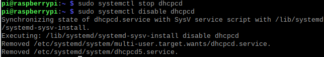
5. Restart the Raspberry Pi with `sudo reboot -h now`
6. Configure the connections by clicking on the new network manager icon at the top right.</br></br>
   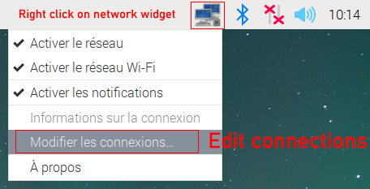
7. Add a network by clicking on the + button</br></br>
   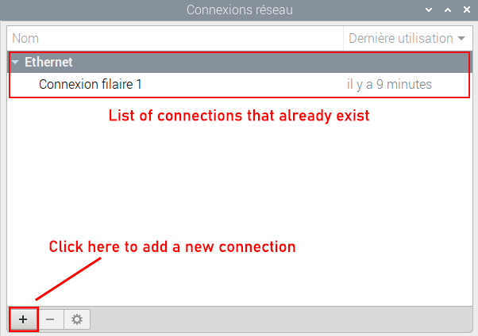
8. Select the Wifi type</br></br>
   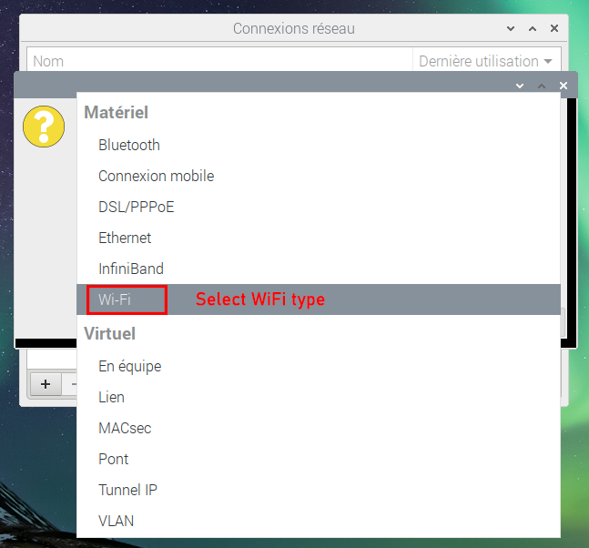
9. Select Hotspot mode</br></br>
   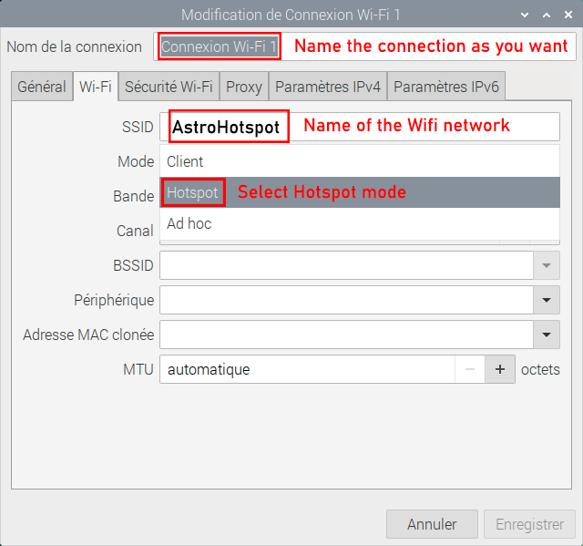
10. Reboot and the changes should take effect.

You will notice that even if you are connected to the Hotspot, you can't do VNC because the service has to be started from the Raspberry Pi itself.
What I recommend to do, is to first connect to your Raspberry Pi in **SSH** and then start the VNC service.

1. Install [PuTTY](https://putty.org/ "PuTTY") if your second device is a Windows laptop or [JuiceSSH](https://play.google.com/store/apps/details?id=com.sonelli.juicessh&hl=en "JuiceSSH") if it's an Android.
2. Connect to the Raspberry Pi Hotspot and get its IP Address.</br>
   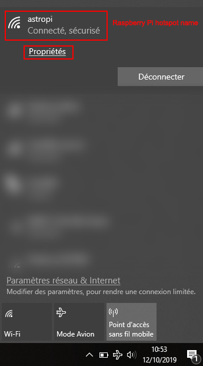 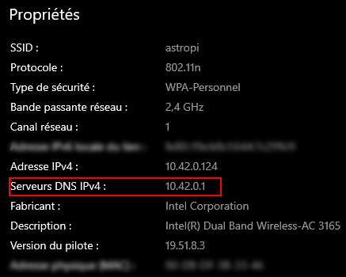
3. Enter IP Address in PuTTY.</br></br>
   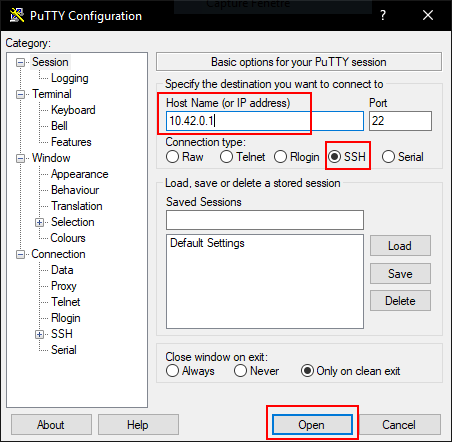
4. Once connected, enter your login and password. Then, run `vncserver`.</br></br>
   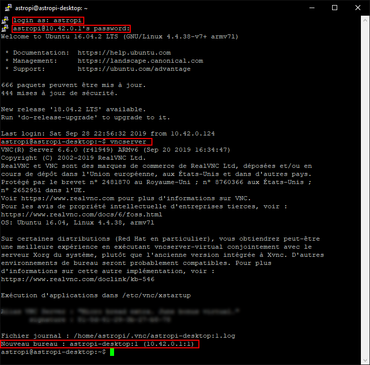
5. You can now open VNC Viewer and control your Raspberry Pi !

## 4. Basic workflow

1. Connect all your equipment to the Raspberry Pi (DSLR, guiding camera, GPS, mount...).
2. Start the Raspberry Pi. It will automatically create his own Hotspot.
3. Connect your PC or smartphone to the Hotspot.
4. Launch SSH client on your device and connect to the Raspberry Pi.
5. Start VNC Server from SSH.
6. Connect your device to VNC.
7. Launch Kstars and enjoy imaging !</br></br>


