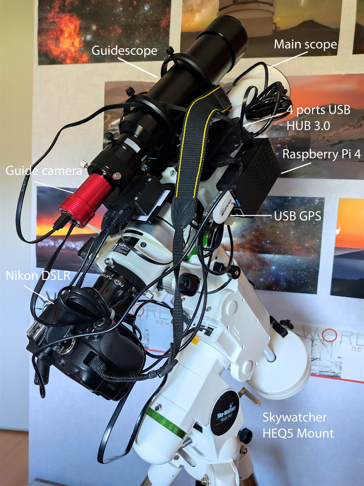
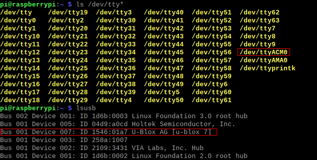
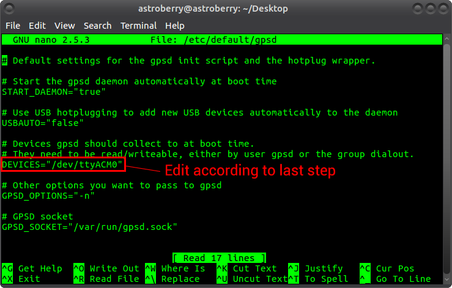
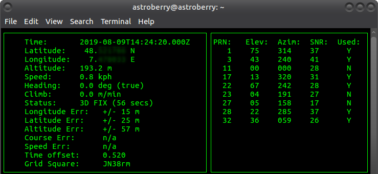
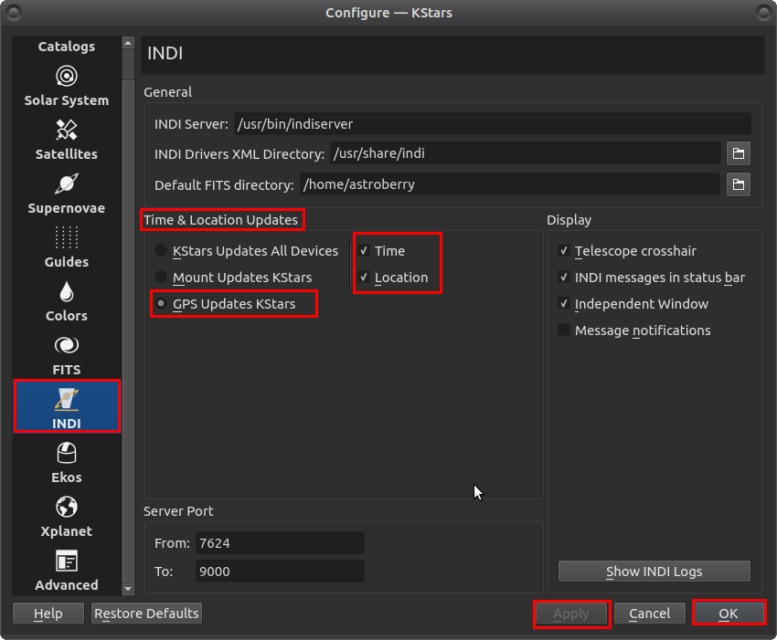
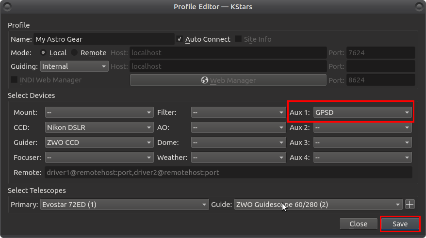
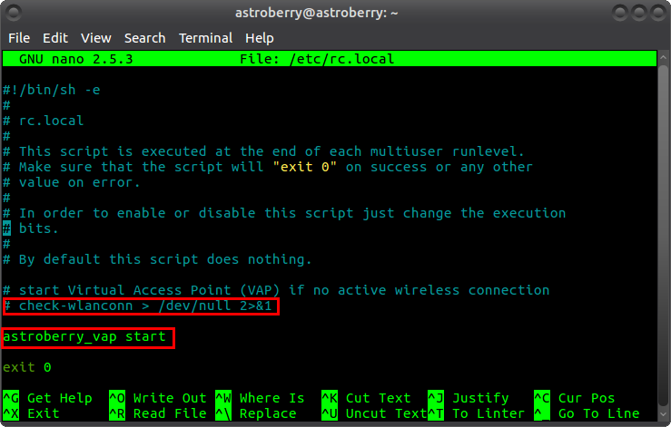

# Astrophotography equipment control

Carrying a laptop for astrophotography can sometimes be annoying. In the field, you have to worry about battery life, long cables connecting all your stuff (camera, focuser, mount, filterwheel, autoguider...), drivers and compatibility, etc. It can quickly get messy. A good alternative is to use a USB Powered Hub attached to the scope or the mount, but that only solves a third of the problems mentioned above. In order to get out of trouble, I found a solution that is light, portable, functional and cheap for any astrophotography setup.

_Lire ce document en français : https://github.com/Kelian98/Easy-astrophotography-equipment-control/blob/master/README.fr.md_

> Note 1 : I have attached my Raspberry Pi with velcro strips, it works great.

> Note 2 : As you can see, I still have crazy long cables hanging on this picture. Since, I have replaced them with shorter cables and tied them up.

## Equipment needed

First of all, we will assume that you have some scope, GoTo mount, camera, guiding camera. That's all we need for setting up a portable computer capable of managing all these devices. More accessories can be add including filter wheel, electronic focuser, etc.

For our system, we will use :

- [Raspberry Pi 3](https://www.amazon.com/s?k=raspberry+pi+3&ref=nb_sb_noss_1:// "Raspberry Pi 3") with case, heatsinks and Micro SD Card (32Go or more recommended)
- [USB Power Bank](https://www.amazon.com/s?k=power+bank&ref=nb_sb_noss_2 "USB Power Bank") with a capacity of at least 10,000mAh and 2.1-2.5A USB output
- [Specific cable](https://www.firstlightoptics.com/sky-watcher-mount-accessories/lynx-astro-ftdi-eqdir-usb-adapter-for-sky-watcher-eq5-pro-heq5-syntrek-pro-az-eq5-gt-az-eq6-gt-and-eq8-mounts.html "Specific cable") to connect your mount to the board (in this case, EQDIR cable for SkyWatcher mounts)
- [GPS USB Dongle](https://www.amazon.com/s?k=vk-172&ref=nb_sb_noss_1 "GPS USB Dongle") to obtain precise location (I use a Vk-172, but Vk-162 is built with a better antenna and is also compatible)

As you can see, it costs around 100\$, far cheaper than a dedicated astro computer running on Windows with commercial softwares which run on 12V power supply.

> Note : You can save some money if you have a USB powered dew-heater for your scope such as [these](https://www.amazon.com/Telescopes-Temperature-Control-Devices-Freezing/dp/B07R299MQT/ref=sr_1_4?keywords=dew%2Bheater%2Busb&qid=1564516783&s=gateway&sr=8-4&th=1). Indeed, buying a USB powerbank with more capacity than 10,000mAh (let's say +20,000mAh) let you power the Raspberry Pi and your dew-heater(s) for a night long. And it's more convenient than having long cables from the floor with your 12V AGM Battery ascending to the moving telescope. See [Raspberry Pi 3 measured power consumption](https://raspi.tv/2016/how-much-power-does-raspberry-pi3b-use-how-fast-is-it-compared-to-pi2b) for further information.

## Software

We will run [Astroberry Server](https://github.com/rkaczorek/astroberry-server "Astroberry Server") on the Raspberry Pi 3. This is an open-source modified version of Ubuntu Mate 16.04 created by [Radek Kaczorek](https://github.com/rkaczorek "Radek Kaczorek") that contains all we need.
You can get instructions [here](https://github.com/rkaczorek/astroberry-server#how-to-use-it "here").
The system features many astronomy softwares including Kstars and Ekos (INDI Library) we will be mainly using.

### 1. Install Astroberry Server

First, get the image from this link : https://drive.google.com/file/d/1zGwXLWDD8hubpuarafMWPft6F6Q4bV8R/view. 
Then, if you are on Windows, download the latest version of Etcher from this link : https://www.balena.io/etcher/. 
Finally, get the free version of Winrar to unpack Astroberry image file : https://www.win-rar.com/start.html?&L=0.

Now that we have finished with softwares installations, let's flash Astroberry on the Raspberry Pi 3.

1. Unpack .xz extension file downloaded above with WinRar.
2. Simply insert your Micro SD Card (inside the adaptor for SD format) in your SD Card slot of your computer.
3. Start Etcher, select the previously unpacked .img extension file, select the drive of your SD Card, and click on Flash !
4. Wait until process is finished... Writing speed depends on your Micro SD Card (class 10 or better is a good choice for Raspberry Pi usage).
5. When it's done, eject your SD Card from your computer and insert it into the Raspberry Pi 3.

> Note : Some of the softwares cited above exist for MacOS and Linux distributions as well.

### 2. Additional drivers

Start the Raspberry Pi 3 with SD Card and plug in a mouse, a keyboard and a monitor.
If everything has been done correctly, it will boot up and get you to Astroberry desktop.
You can connect it to your personal newtork by clicking on WLAN logo at the top-right of the screen. Enter your network information and you will be connected to Internet.

#### 2.1 DSLR

This sub-section aims to install required drivers if you want to use a DSLR not directly recognized by Ekos. In my case, I wasn't able to control my Nikon D3300 on Windows despite all attempts with many softwares (Sequence Generator Pro, BackyardNikon, APT Astrophotography Tool, etc).

I found a driver called gPhoto for Linux ([here](http://www.gphoto.org/proj/libgphoto2/support.php "here") you can find all compatible DSLR Cameras) that was compatible with my camera. I was able to find a good tutorial that worked for me to install it on the Raspberry Pi 3.
Just need to follow the instructions : [Install libgphoto2 and gphoto2 from source on Raspberry Pi](https://hyfrmn.wordpress.com/2015/02/03/install-libgphoto2-and-gphoto2-from-source-on-raspberry-pi/ "Install libgphoto2 and gphoto2 from source on Raspberry Pi")

#### 2.2 GPS

If you use the Vk-162 or Vk-172, you can follow this steps :

1. Plug the GPS in Raspberry Pi USB port.
2. Open a command terminal by pressing CTRL + ALT + T or right-click on Desktop and select "Open in terminal".
3. Install gpsd package : `sudo apt-get install gpsd`.
4. To see on which port the GPS is connected, type : `ls /dev/tty*`. When plugging/unplugging the GPS, some address such as /dev/ttyACM0 or /dev/ttyACM1 should appear and disappear. **Keep it in mind**. 
   
5. Now you have to configure the GPS default file. Type `sudo pico /etc/default/gpsd` and edit DEVICES="port obtained at step 4". 
   
6. Press CTRL + X to exit and save changes by pressing Y when asked.
7. Again in terminal, type : `service gpsd restart`.
8. Finally to know if the GPS is working, look if the green LED is blinking and type : `cgps -s`, you should see current information received by the GPS.
   
9. The GPS is now working !

You can also watch this video with similar process : https://www.youtube.com/watch?v=tQz8Fo5u7Lc&t=820s

> Note 1 : Indoor, the GPS may be unable to find signal. I recommend to do this outside.

> Note 2 : I always plug the GPS in the same USB port in order to keep the default file the same. Otherwise, I would probably have to repeat steps 3 and 4 each time I plug it in another USB port.

### 3. Setting up Kstars and Ekos

I will not explain in depth how to setup Ekos for general usage with your equipment because there are plenty of good tutorials online, here is a list :

- Old but great tutorial for general usage and configuration : https://www.youtube.com/watch?v=wNpj9mNc0RE (only interface has changed)
- This playlist explains each module and their usage : https://www.youtube.com/playlist?list=PLn_g58xBkqHuPUUOnqd6TzqabHQYDKfK1
- A short live session which explores some modules and functionnalities : https://www.youtube.com/watch?v=3uwyRp8lKt0
- Official documentation offers some tutorials : https://www.indilib.org/about/ekos.html

> Note : For specific topics, you can search on the [INDI official forum](https://www.indilib.org/forum.html "INDI official forum"), ask on Facebook groups...

#### GPS

To use the Vk-162 or Vk-172 GPS in Ekos, follow this steps (after completing step 2.2) :

1. Make sure the GPS is properly connected to the Raspberry Pi (see step 2.2).
2. Launch Kstars, go to _Settings > Configure Kstars > INDI_ and select _GPS Updates Kstars_ under _Time & Location updates_. Be sure that _Time_ and _Location_ are also checked.
3. Click _Apply_ and _OK_. 
   

Now, in order to add it to your Ekos Profile, you have to edit your Ekos profile and in _Auxiliary_, add **GPSD**.

When starting INDI, you should see something like this under **GPSD** section :

> Note : If you click on **GPS** in _Refresh_ section, coordinates will be updated.

### 4. Configure the Raspberry Pi for remote desktop

There is a "virtual access point" tool aleady installed on Astroberry. However, I got some trouble with it.
When you have connected the Raspberry Pi to your personal wireless network, the board will automatically look for it on boot up. Normally, Astroberry is pre-configured to switch to virtual access point if it cannot reach the personal wireless network. I had a big surprise in the field when it didn't work... So, to be sure that it is always in virtual access point, you should follow these instructions :

1. Open a terminal with CTRL + ALT + T
2. Type : `sudo nano /etc/rc.local` and enter the root password (by default : astroberry)
3. Comment the line `check-wlanconn > /dev/null 2>&1` and type under it `astroberry_vap start` such as :
   
4. Exit and save changes !

Now, when the Raspberry boots up, it will create a personal wireless network called **astroberry**. The password to connect to it is also astroberry. Go in your browser to http://192.168.10.1/ and you will be able to use your Raspberry Pi in remote access !
